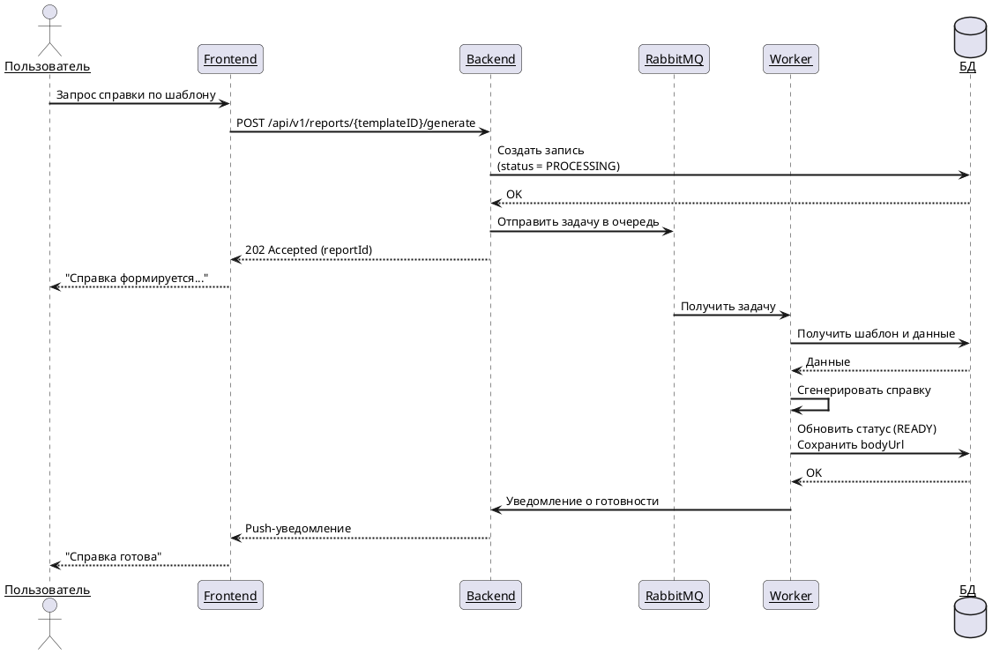
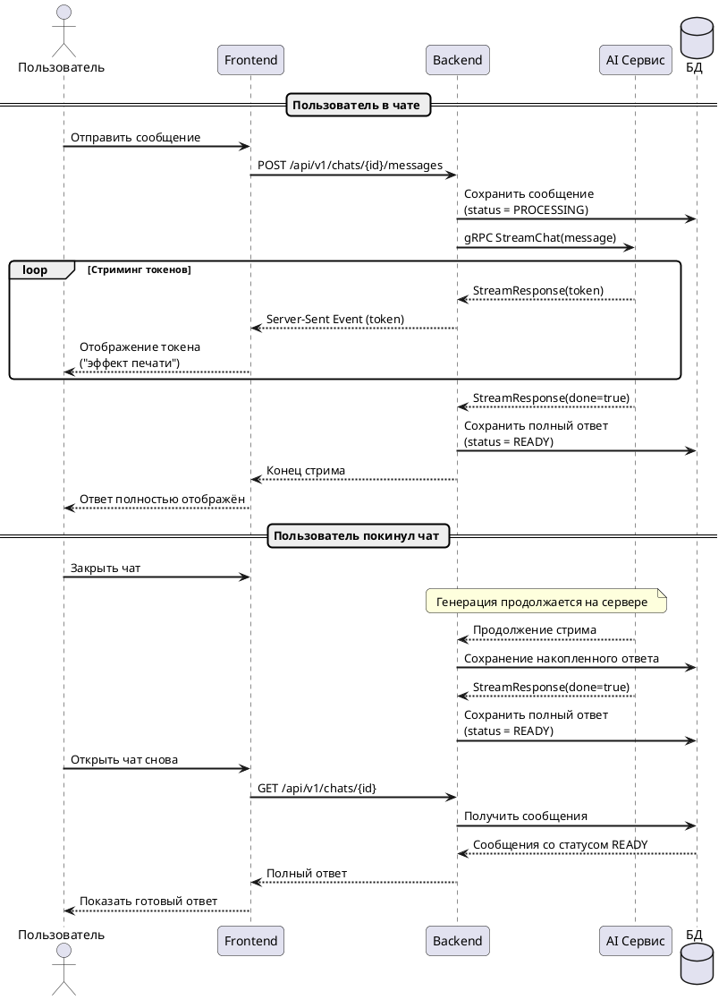

# Асинхронные взаимодействия

В системе реализовано два асинхронных взаимодействия:

1. **Генерация справок** — пользователь запрашивает справку и может покинуть экран; уведомление придёт по готовности
2. **Ответ от ИИ** — ответ стримится в реальном времени («эффект печати»); при выходе из чата полный ответ будет доступен при следующем открытии

---

## 1. Генерация справок

### Технология: RabbitMQ

| Технология | Плюсы | Минусы |
|------------|-------|--------|
| Apache Kafka | Высокая производительность, масштабируемость | Избыточность для данного сценария, сложность настройки |
| **RabbitMQ** ✅ | Гарантированная доставка, простота внедрения | Меньшая пропускная способность vs Kafka |

**Обоснование выбора RabbitMQ:** обеспечивает очередь задач на генерацию, надёжность доставки и возможность масштабирования в следующих версиях.

### Sequence-диаграмма (PlantUML)

### Контракт (AsyncAPI)

Формат данных: **JSON**  
Скачать спецификацию: [asyncapi.yaml](/media-and-data/asyncapi.yaml)

---

## 2. Стриминг ответа от ИИ

### Технология: gRPC

| Технология | Плюсы | Минусы |
|------------|-------|--------|
| WebSocket | Realtime, двунаправленная связь | Нет строгой типизации, сложность поддержки контракта |
| **gRPC** ✅ | Потоковая передача, высокая производительность, низкая задержка | Сложнее реализация, требует protobuf |

**Обоснование выбора gRPC:** потоковая передача ответа, минимальная задержка, строгая типизация и формализованный контракт.

### Sequence-диаграмма (PlantUML)

### Контракт (protobuf)

Формат данных: **Protocol Buffers**  
Скачать спецификацию: [gRPC.proto](/media-and-data/gRPC.proto)
