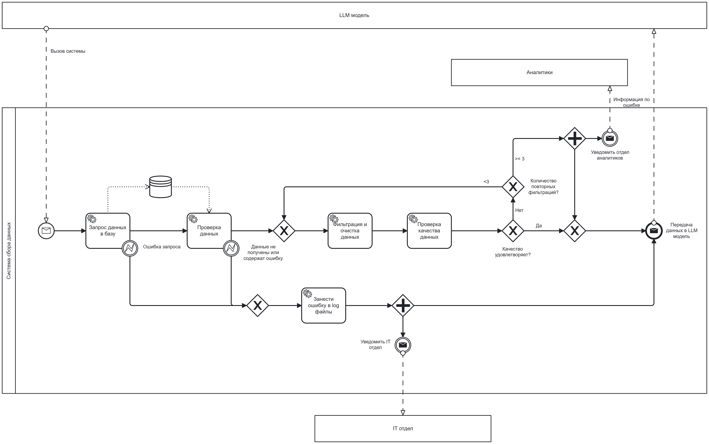
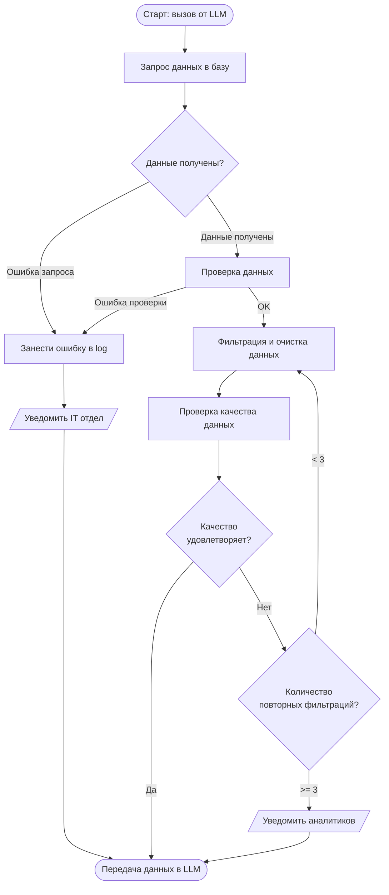

import BpmnViewer from '@site/src/components/BpmnViewer';

# Процесс сбора данных (BPMN)

## Описание процесса

Диаграмма описывает процесс сбора и обработки производственных данных. Любой результат, который возвращает система сбора данных, передаётся в LLM-модель (ИИ-агента), которая уведомляет пользователя.

**Участники процесса:**
- **LLM модель** — инициирует запрос и получает результат
- **Система сбора данных** — основной исполнитель процесса
- **Аналитики** — получают уведомление при исчерпании попыток фильтрации
- **IT отдел** — получает уведомление при критических ошибках

## BPMN-диаграмма

---

## Общий поток процесса (Mermaid)

---

## DMN-таблица проверки качества данных

### Назначение

DMN-таблица используется для автоматизированной оценки качества входных данных на этапе обработки. Определяет, достаточно ли данные очищены, полны и корректны. Если нет — возвращает уровень фильтрации для повторной обработки.

**Преимущества DMN:**
- Формализует критерии отбора данных
- Исключает субъективность в принятии решений
- Упрощает масштабирование — правила меняются без изменения BPMN
- Повышает повторяемость результата

### Входные параметры

| Параметр | Описание |
|----------|----------|
| `completeness` (% полноты) | Степень заполненности обязательных полей |
| `dataCount` (количество) | Достаточность объёма для статистически значимой обработки |
| `noiseLevel` (уровень шума) | Наличие выбросов и ошибок в данных |
| `filterRetryCount` (счётчик фильтраций) | Ограничение бесконечных циклов очистки |

### Логика принятия решений

| Условие | Решение |
|---------|---------|
| Полнота высокая, шум низкий, retries в норме | ✅ **Принято** |
| Низкая полнота или высокий шум | ⚠️ **Отклонено** → повторная фильтрация |
| Шум очень высокий | ⚠️ **Отклонено** → фильтрация Level 2/3 |
| Достигнут предел повторных фильтраций | ❌ **Отклонено окончательно** → фиксация ошибки |

:::info Файлы
Скачать XML-файл BPMN: [process.bpmn](/media-and-data/process.bpmn)  
Скачать XML-файл DMN: [process.xml](/media-and-data/process.xml)
:::
