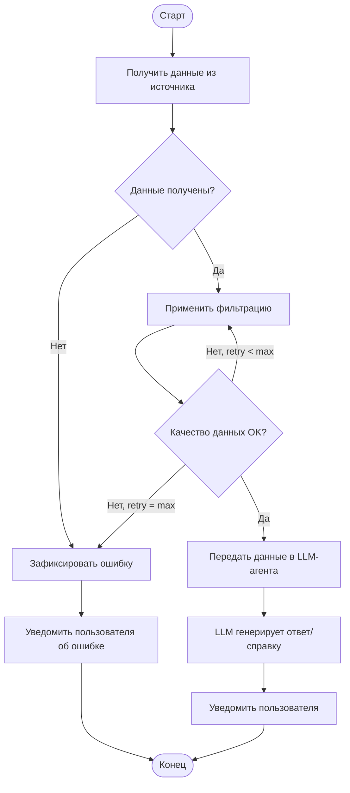

# Процесс сбора данных (BPMN)

## Описание процесса

Диаграмма описывает процесс сбора и обработки производственных данных. Любой результат, который возвращает система сбора данных, передаётся в LLM-модель (ИИ-агента), которая уведомляет пользователя.

## BPMN-диаграмма

<iframe
  src="https://unidraw.io/app/board/2e0c6f0c37a719d207ce"
  width="100%"
  height="600px"
  style={{border: '1px solid #e0e0e0', borderRadius: '8px'}}
  title="BPMN-диаграмма процесса сбора данных"
/>

:::info
Если диаграмма не отображается — [открыть напрямую на unidraw.io](https://unidraw.io/app/board/2e0c6f0c37a719d207ce)
:::

---

## Общий поток процесса (Mermaid)

---

## DMN-таблица проверки качества данных

### Назначение

DMN-таблица используется для автоматизированной оценки качества входных данных. Определяет, достаточно ли данные очищены, полны и корректны. Если нет — возвращает уровень фильтрации для повторной обработки.

**Преимущества DMN:**
- Формализует критерии отбора данных
- Исключает субъективность в принятии решений
- Упрощает масштабирование — правила меняются без изменения BPMN
- Повышает повторяемость результата

### Входные параметры

| Параметр | Описание |
|----------|----------|
| `completeness` (% полноты) | Степень заполненности обязательных полей |
| `dataCount` (количество) | Достаточность объёма для статистически значимой обработки |
| `noiseLevel` (уровень шума) | Наличие выбросов и ошибок в данных |
| `filterRetryCount` (счётчик фильтраций) | Ограничение бесконечных циклов очистки |

### Логика принятия решений

| Условие | Решение |
|---------|---------|
| Полнота высокая, шум низкий, retries в норме | ✅ **Принято** |
| Низкая полнота или высокий шум | ⚠️ **Отклонено** → повторная фильтрация |
| Шум очень высокий | ⚠️ **Отклонено** → фильтрация Level 2/3 |
| Достигнут предел повторных фильтраций | ❌ **Отклонено окончательно** → фиксация ошибки |

:::info Файл DMN
Скачать XML-файл: [process.xml](/media-and-data/process.xml)
:::
