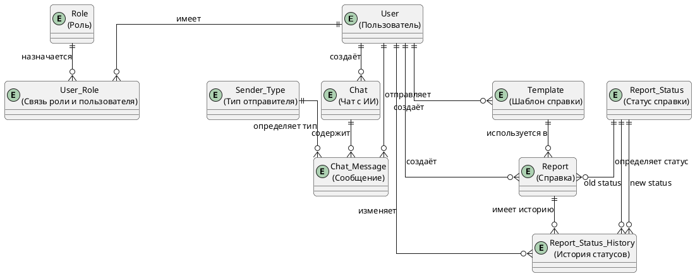
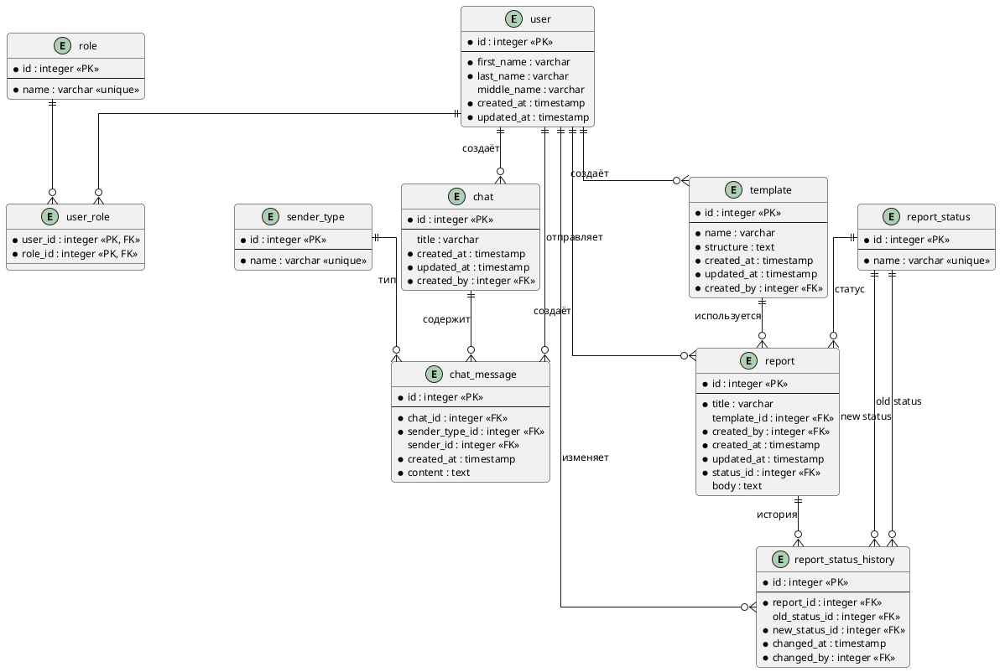
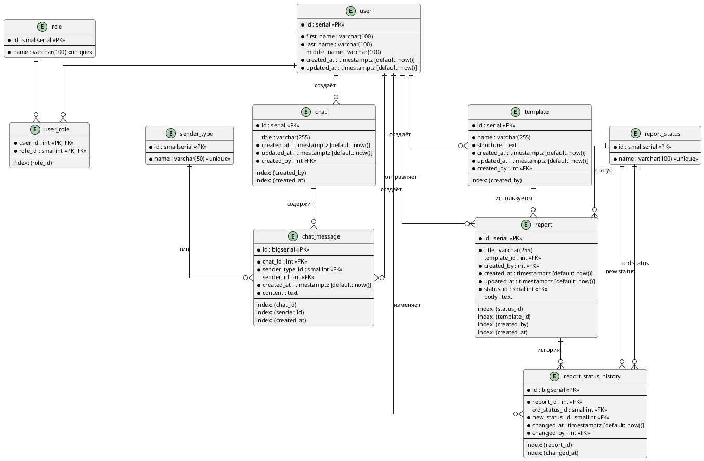

# Модель данных (ERD)

## Концептуальная модель

Были выделены следующие сущности:

1. **User** (пользователь) — субъект всех действий в системе
2. **Role** (роль) — справочник в котором содержится информация о ролях и доступах
3. **Chat** (чат с ИИ) — контейнер в котором содержится диалог с ИИ
4. **Chat_Message** (сообщение) — сообщение в чате, формирует историю диалога
5. **Report** (справка/отчёт) — основной документ, который формирует система
6. **Template** (шаблон справки) — инструкция по которой формируется справка
7. **Report_Status** (статус отчёта) — справочник с состояниями справки
8. **Report_Status_History** (история статуса отчёта) — таблица с данными об изменениях статусов справок
9. **Sender_Type** (справочник) — справочник в котором содержится список типов отправителей
10. **User_Role** (связь роли и пользователя) — справочник в котором хранится информация о том какие роли есть у пользователя

---

## Логическая модель

Выделены сущности `role` и `report_status`, т.к. в процессе развития системы могут добавляться роли и статусы — использовать enum нецелесообразно. Применён паттерн **L2**.

Применён паттерн **L3** — история изменений для сущности `report_status_history`. Справки меняют статус во время жизненного цикла (`PROCESSING`, `READY`, `ERROR`) и его необходимо отслеживать.

Выделена сущность `User_Role` (паттерн **L1**) для связи ролей и пользователя — у одного пользователя может быть несколько ролей для доступа к разным частям системы.

---

## Физическая модель

Т.к. часть данных (`chat_message`, `report_status`, `report_status_history`) обновляется чаще остальных, их можно считать горячими данными и вынести в отдельные таблицы (паттерн **Р1**).

Применён паттерн **Р4** — индексация. Актуальные данные запрашиваются чаще исторических, поэтому индексация применена в таблицах `report`, `chat`, `chat_message`.

---

## Размещение в хранилищах

| Сущность | Хранилище | Обоснование |
|----------|-----------|-------------|
| user, role, user_role, chat, template, report, report_status | PostgreSQL | ACID, реляционные связи |
| chat_message, report_status_history | PostgreSQL (горячие таблицы, паттерн Р1) | Высокая частота записи и чтения |
| sensor_data | TimescaleDB (Time-Series) | Миллионы записей с временными метками |
| system_logs | Elasticsearch | Полнотекстовый поиск по логам |
| report.body (файлы) | Object Storage (S3) | Хранение крупных документов |
