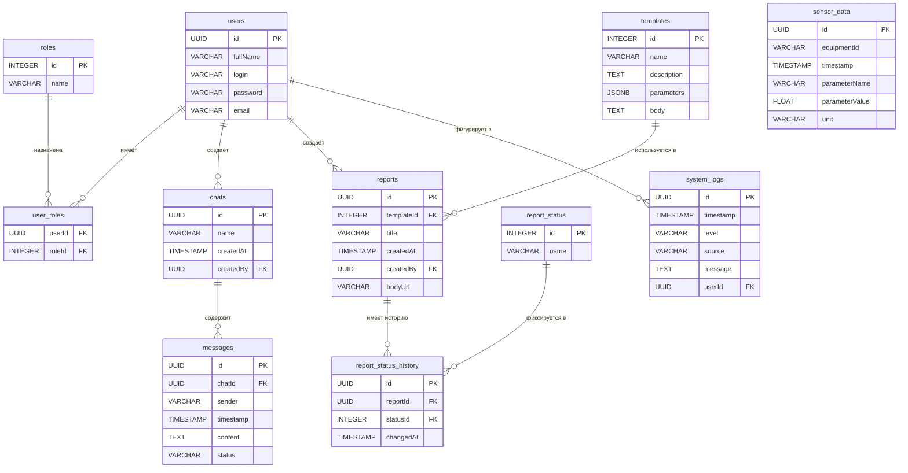

# Модель данных (ERD)

## Концептуальная модель

---

## Логическая модель

Выделены сущности `role` и `report_status`, т.к. в процессе развития системы могут добавляться роли и статусы — использовать enum нецелесообразно. Применён паттерн **L2**.

Применён паттерн **L3** — история изменений для сущности `report_status_history`. Справки меняют статус во время жизненного цикла (`PROCESSING`, `READY`, `ERROR`) и его необходимо отслеживать.

Выделена сущность `User_Role` (паттерн **L1**) для связи ролей и пользователя — у одного пользователя может быть несколько ролей.

---

## Физическая модель

Применён паттерн **Р1** — горячие данные (`chat_message`, `report_status`) вынесены в отдельные таблицы.

Применён паттерн **Р4** — индексация в таблицах `report`, `chat`, `chat_message`.

---

## Диаграмма связей (Mermaid ERD)

---

## Размещение в хранилищах

| Сущность | Хранилище |
|----------|-----------|
| users, roles, chats, messages, reports, templates | PostgreSQL |
| sensor_data | TimescaleDB (Time-Series) |
| system_logs, chats (поиск) | Elasticsearch |
| reports.body (файлы) | Object Storage (S3-совместимый) |
